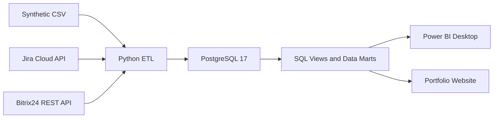
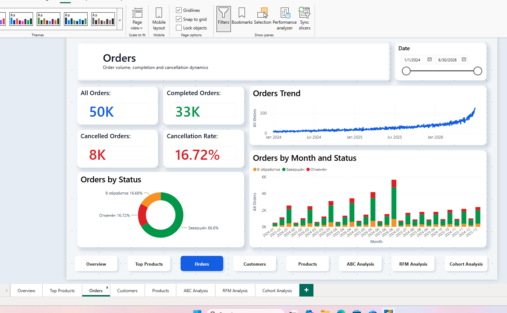
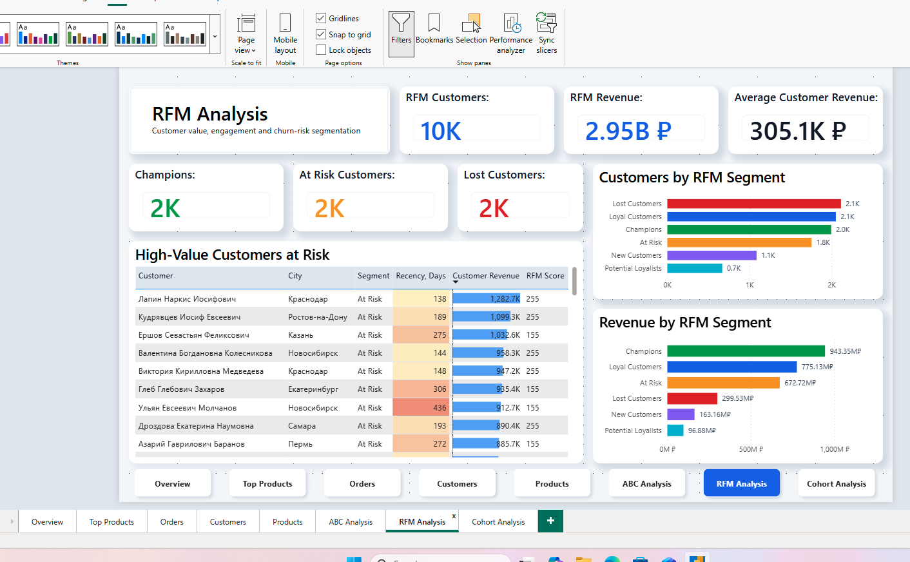
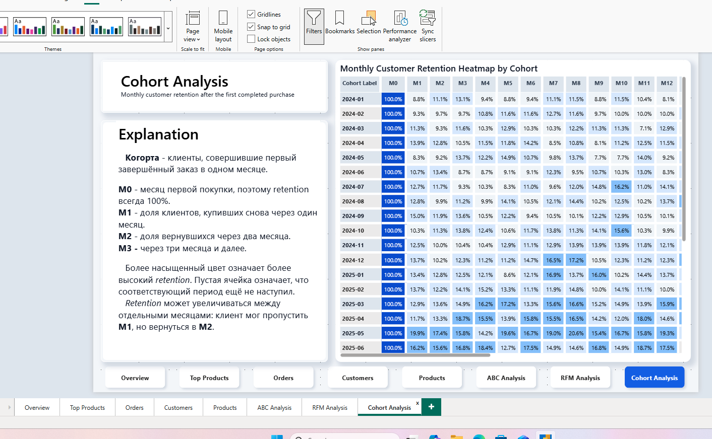

# BI Sales Analytics

Полноценный BI-проект, моделирующий аналитическую систему интернет-магазина.

Этот проект — результат моего самостоятельного изучения BI систем. В процессе разработки я последовательно использую Python, PostgreSQL, SQL, Docker, Power BI и DAX, создавая полноценную аналитическую систему для интернет-магазина. Все этапы — от генерации данных до построения дашбордов — реализованы в рамках одного репозитория.

---

## Возможности проекта

1. Генерация реалистичных данных на Python

2. Хранилище данных PostgreSQL

3. Работа через Docker

4. SQL-представления для аналитики

5. Построение модели данных (Star Schema)

6. DAX-меры

7. Интерактивные дашборды Power BI

8. Проверка качества данных (Data Quality)

---

## Стек

- Python
- PostgreSQL
- Docker
- SQL
- Power BI
- DAX
- Git

# SportStore Analytics Platform

Портфельный BI-проект интернет-магазина спортивных товаров: от генерации и
проверки данных до SQL-витрин, бизнес-аналитики и восьмистраничного отчёта
Power BI.


## Результат

- **2.95B ₽** выручки и **1.06B ₽** прибыли в синтетическом датасете.
- **50 000** заказов, **10 000** клиентов и **1 000** товаров.
- PostgreSQL в Docker с аналитическими представлениями.
- Python-генератор данных и заготовка ETL для Jira Cloud и Bitrix24.
- Power BI: Executive Overview, Orders, Customers, Products, ABC, RFM и Cohort Analysis.
- Публичный презентационный сайт без ключей и учётных данных.

> Данные полностью синтетические и используются только для обучения и
> демонстрации навыков. Финансовые результаты не относятся к реальной компании.

## Архитектура



Основной аналитический слой:

- `sales_report` — детальные продажи;
- `daily_kpi` — ежедневные KPI;
- `product_abc` — ABC-классификация товаров;
- `customer_rfm` — RFM-метрики и клиентские сегменты;
- `customer_cohort_retention` — ежемесячный когортный retention;
- `jira_delivery_kpi` и `crm_funnel_kpi` — витрины внешних интеграций.

## Power BI

Отчёт построен на календарной таблице, явных DAX-мерах и однонаправленных
связях. Ключевые показатели сверены с PostgreSQL. Зафиксированное время
загрузки страницы — до **1.2 секунды**, максимальное выполнение DAX-запроса —
около **174 мс**.

| Аналитическая страница | Назначение |
| --- | --- |
| Executive Overview | Revenue, Profit, Orders, Customers, AOV и Margin |
| Top Products | Рейтинг товаров по выручке |
| Orders | Объём заказов, статусы и Cancellation Rate |
| Customers | Активность, повторные покупки и география |
| Products | Продажи, прибыльность и товарные категории |
| ABC Analysis | Вклад классов A/B/C в выручку |
| RFM Analysis | Ценность, лояльность и риск оттока |
| Cohort Analysis | Monthly customer retention heatmap |

<details>
<summary>Открыть дополнительные скриншоты</summary>





</details>

## Стек

- PostgreSQL 17, SQL, views, CTE и оконные функции;
- Docker Compose и pgAdmin;
- Python, Faker, psycopg, Requests и python-dotenv;
- Power BI Desktop, Power Query и DAX;
- Git и статический HTML/CSS/JavaScript;
- Jira Cloud REST API и Bitrix24 webhook — опциональные источники.

## Быстрый запуск

### 1. Инфраструктура

```bash
docker compose up -d
docker compose ps
```

PostgreSQL доступен на `localhost:5434`, pgAdmin — на
`http://localhost:5050`. Учётные данные в `compose.yaml` предназначены только
для локального учебного окружения.

### 2. Python и тестовые данные

```bash
python3 -m venv .venv
source .venv/bin/activate
pip install -r requirements.txt
python python/generate_data.py
```

Генератор создаёт CSV в `data/`. Для крупной загрузки используется PostgreSQL
`COPY`, чтобы не выполнять тысячи отдельных `INSERT`.

### 3. SQL-слой

Скрипты выполняются в порядке нумерации:

```text
sql/01_create_tables.sql
sql/02_insert_test_data.sql
sql/03_create_views.sql
sql/04_analytics.sql
sql/05_integrations.sql
```

### 4. Интеграции

В данный момент интеграции с Jira и Битрикс 24 находятся в разработке.

### 5. Презентационный сайт

В данный момент в разработке

